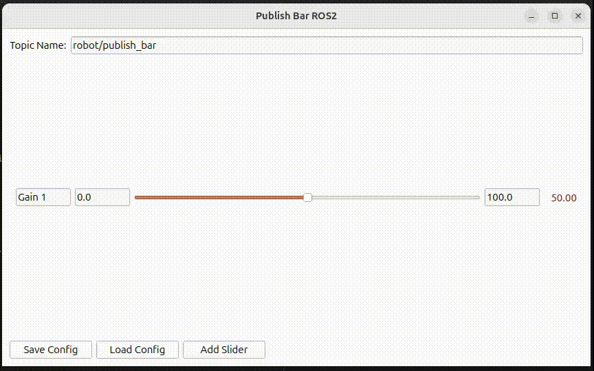

# Publish Bar


- Publish Bar is a lightweight GUI tool for dynamically publishing numeric values through sliders.
Inspired by rqt_ez_publisher, it provides an intuitive interface for tuning parameters in ROS1, ROS2, or LCM .
- Inspired from [rqt_ez_publisher](https://github.com/OTL/rqt_ez_publisher), Publish Bar was designed to help tune parameters with sliders. Currently it supports for ROS, ROS2 and Lcm 
### Features:
- Dynamically change the topic name directly from the interface
- Adjustable minimum and maximum slider values
- Add as many sliders as you need
- Save and load full configurations (topic name, slider names, ranges, and values)
- Out of the box, It works in ROS1, ROS2, and LCM,


### Files Overview

| File | Description |
|------|--------------|
| **publish_bar_lcm.py** | Publishes values using **LCM**. Message type is defined in `/lcm_msg/lcm_std/FloatMultiArray.py`. |
| **publish_bar_ros1.py** | Publishes values using **ROS1** (`std_msgs/msg/Float32MultiArray`). |
| **publish_bar_ros2.py** | Publishes values using **ROS2** (`std_msgs/msg/Float32MultiArray`). |


## Install
Run the following commands
```text
pip install PyQt5 PyQt5-tools
pip install PySide6
```
No need to run`catkin build` or `colcon build` for ROS1 and ROS2 communications,   

## How to use:
Run the script corresponding to your target middleware.
For example, to use ROS2:
```text
python3 publish_bar_ros2.py
```

### Save Config
- Click Save Config bottun at the left bottom corner and save files as json file (`.json`)

### Load Config
- Click Load Config Button and select a config file you saved

## Developers Guide
- If you want to modify the message type or extend support to a new middleware (e.g., WebSocket, ZeroMQ, etc.),
start with`publish_bar_lcm.py` t’s the simplest reference implementation. `class publishBar(QWidget)/def publish(self)` shows how Publish Bar publishes a message using middleware, Lcm.

## ToDo
- add features to dynamically change message type (Twist, Vector3, Pose, etc)


