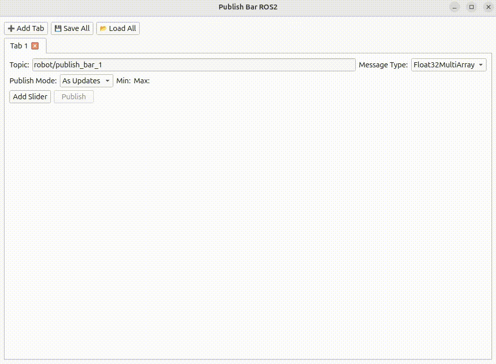

# Publish Bar


- Publish Bar is a lightweight GUI tool for dynamically publishing numeric values through sliders.
Inspired by [rqt_ez_publisher](https://github.com/OTL/rqt_ez_publisher),, it provides an intuitive interface for tuning parameters in ROS1, ROS2, or LCM .

### Features:
- Dynamically change the topic name directly from the interface
- Adjustable minimum and maximum slider values
- Publish multiple messages simultaneously
- Switch outputs between raw values and degree-to-radian conversion
- Save and load full configurations (topic name, slider names, ranges, and values)
- Out of the box, It works in ROS1, ROS2, and LCM,
- Supported message types: `String`, `Float32MultiArray`, `Vector3`, `Twist`, `Pose`, `JointState`

### Files Overview

| File | Description |
|------|--------------|
| **publish_bar_lcm.py** | Publishes values using **LCM**. Message type is defined in `/lcm_msg/lcm_std`. |
| **publish_bar_ros1.py** | Publishes values using **ROS1** . |
| **publish_bar_ros2.py** | Publishes values using **ROS2** . |


## Install
Run the following commands
```text
pip install PyQt5 PyQt5-tools
pip install PySide6
```
No need to run`catkin build` or `colcon build` for ROS1 and ROS2 communications,   

## How to use:
Run the script corresponding to your target middleware.
For example, to use ROS2:
```text
python3 publish_bar_ros2.py
```
### Output Modes (available only for angular data)
- Raw values: Outputs the exact values shown on the sliders, without any conversion.
- Deg → Rad: Interprets slider values as degrees and outputs the corresponding values converted to radians.

### Save Config
- Click Save Config bottun at the left bottom corner and save files as json file (`.json`)

### Load Config
- Click Load Config Button and select a config file you saved

## Developers Guide
- If you want to extend support to a new middleware (e.g., WebSocket, ZeroMQ, etc.), start with `publish_bar_lcm.py` and `components/scripts/lcm/dynamicContentLcm.py` It’s the simplest reference implementation.